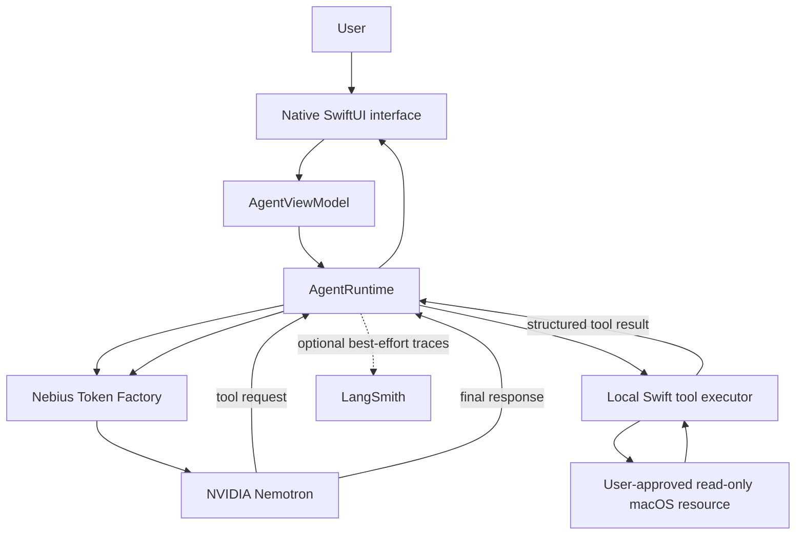

# Personal AI

Personal AI is a native macOS agent built with SwiftUI. It uses NVIDIA Nemotron through Nebius Token Factory for inference, while executing approved tools locally in Swift. The current application provides a real multi-step tool-calling loop, read-only access to user-approved folders, local SQLite conversation history, and optional privacy-conscious LangSmith tracing.

This project is being developed for the **Nebius x NVIDIA Global AI Hackathon**.

## Why Personal AI

Personal AI explores a practical boundary between cloud intelligence and local control. Nemotron decides when a tool is needed, but macOS permissions and Swift policy code determine what the tool can actually access. Private resources are never made available merely because the model requests them.

## Architecture



LangSmith is observability only. It is not part of the execution or decision path, and agent requests continue normally when tracing is disabled or unavailable.

## Current Features

Implemented:

- Native macOS SwiftUI chat experience with Markdown rendering.
- Dynamic discovery and selection of an available NVIDIA Nemotron model from Nebius Token Factory.
- Multi-turn agent loop supporting sequential model and tool calls.
- Local Swift tools for listing directories, searching filenames, reading supported text files, inspecting file metadata, and returning deterministic project information.
- Explicit, persistent folder approval using native macOS folder selection and security-scoped bookmarks.
- Read-only filesystem policy with canonical path validation and protection against traversal and symbolic-link escapes.
- Local SQLite conversation persistence, Recent conversations, rename/delete, and restored model protocol context.
- Optional LangSmith execution tracing with privacy-focused metadata and failure isolation.

Not implemented in the current release:

- File creation, modification, deletion, moving, or renaming.
- Terminal, browser, email, calendar, Git, or screen-control tools.
- Personal memory, entities, relationships, embeddings, or semantic search.
- Cloud conversation synchronization or user accounts.

## Tech Stack

- Swift and SwiftUI
- AppKit and Foundation
- URLSession with async/await
- SQLite3 for application-owned conversation persistence
- NVIDIA Nemotron via the OpenAI-compatible Nebius Token Factory API
- Optional LangSmith REST tracing
- macOS App Sandbox and security-scoped bookmarks

## NVIDIA Nemotron and Nebius Token Factory

At startup, Personal AI queries the Nebius Token Factory model catalog and selects an available model whose identifier begins with `nvidia/` and identifies a Nemotron model. Model identifiers are not assumed or hardcoded. Chat requests and OpenAI-compatible tool definitions are then sent to the selected model through Nebius.

The model performs reasoning and tool selection remotely. Tool validation and execution happen locally in Swift.

## Agent Tool Loop

One request may involve several model/tool turns:

```text
User message
  -> Nemotron request through Nebius
  -> model requests a named tool
  -> AgentRuntime resolves the registered Swift tool
  -> local tool returns structured JSON
  -> result is sent back to Nemotron
  -> additional tool calls if needed
  -> final assistant response
```

For example, a request to explain a project README can cause `search_files` followed by `read_file`. The UI displays only the user and final assistant messages; internal tool protocol messages are retained separately for valid conversation continuation.

## Privacy and Security

- API credentials are read at runtime from environment variables and are never required in source files.
- The application does not automatically load a repository `.env` file.
- Filesystem access is read-only and restricted to folders explicitly approved by the user.
- Path traversal and symbolic-link escapes are rejected by local policy code.
- Conversation data is stored locally in the app's sandbox-compatible Application Support directory, not in an approved document folder.
- Optional LangSmith tracing is disabled when its configuration is absent or false. Its default policy records execution metadata rather than raw document contents or raw tool results.
- Tracing failures never fail the agent request.

Do not commit API keys, Xcode user schemes containing credentials, local databases, conversation backups, or user data.

## Requirements

- macOS 15 or later
- Xcode with the macOS 15 SDK and Swift 5 support
- A Nebius Token Factory API key
- Optional: a LangSmith account and API key for tracing

## Setup

1. Clone the repository.
2. Open `macos/PersonalAI.xcodeproj` in Xcode.
3. Select **Product -> Scheme -> Edit Scheme**.
4. Under **Run -> Arguments -> Environment Variables**, add the required runtime variable:

   ```text
   NEBIUS_API_KEY=your_nebius_api_key
   ```

5. Optionally add LangSmith observability configuration:

   ```text
   LANGSMITH_API_KEY=your_langsmith_api_key
   LANGSMITH_PROJECT=PersonalAI
   LANGSMITH_TRACING=false
   ```

   Set `LANGSMITH_TRACING=true` only when you intend to send privacy-filtered traces. LangSmith is not required for Personal AI to run.

6. Build and run the `PersonalAI` target.
7. In Personal AI, open **Settings -> Files** and approve a folder before asking the agent to inspect it.

Environment values entered in Xcode are developer-local configuration. Never place real values in a shared scheme or commit them to Git.

## Build and Run

From the `macos` directory, a command-line Debug build can be run with:

```bash
xcodebuild \
  -project PersonalAI.xcodeproj \
  -scheme PersonalAI \
  -configuration Debug \
  -destination 'platform=macOS' \
  build
```

For normal use, launch from Xcode so the configured environment variables are available.

## Project Structure

```text
macos/
├── PersonalAI/
│   ├── App/                # App entry point, navigation, appearance
│   ├── Features/Chat/      # Conversation models, state, and UI
│   ├── Features/Settings/  # Settings UI
│   ├── Agent/              # Runtime, protocol models, Nebius provider
│   ├── Tools/              # Tool contract and filesystem tools
│   ├── Persistence/        # SQLite database, models, repositories
│   ├── Observability/      # Optional LangSmith tracing
│   ├── Shared/             # Reusable UI and theme primitives
│   └── Resources/          # Asset catalogs
├── PersonalAI.xcodeproj/
└── Tests/                  # Harnesses grouped by application domain
```

## Testing

The repository contains deterministic harnesses covering the agent loop, filesystem policy and tools, conversation persistence, SQLite migrations and repositories, and tracing privacy/failure isolation. These tests use temporary directories and databases rather than production Application Support data. Live Nebius tests require `NEBIUS_API_KEY`; LangSmith tests use fakes unless explicitly running a configured live trace.

## Hackathon

Personal AI is being built for the **Nebius x NVIDIA Global AI Hackathon**.

- **NVIDIA model:** an available NVIDIA Nemotron model discovered dynamically at runtime.
- **Nebius usage:** model discovery and OpenAI-compatible chat/tool-call inference through Nebius Token Factory.
- **Why Nemotron:** its tool-calling capability drives a native agent loop while macOS-native Swift code retains deterministic control over local access.
- **Runs locally:** SwiftUI, orchestration, tool validation/execution, filesystem permission enforcement, and SQLite persistence.
- **Runs remotely:** Nemotron inference through Nebius Token Factory and, when explicitly enabled, privacy-filtered LangSmith observability.

Submission links:

- Demo Video: coming soon
- Devpost Submission: coming soon
- Demo/Test Build: coming soon

## License

Licensed under the Apache License, Version 2.0. See the repository's `LICENSE` file.
